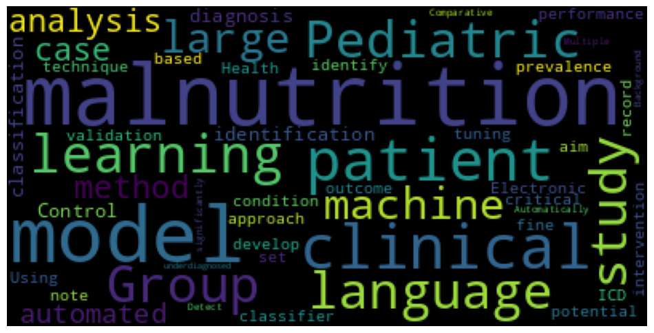

# NutriKids AI: Empowering Early Pediatric Malnutrition Diagnosis for a Brighter Future

Welcome to **NutriKids AI** – an innovative, AI-driven solution designed to revolutionize the early detection of pediatric malnutrition. In pediatric healthcare, early and accurate diagnosis is critical for ensuring timely intervention and improving long-term outcomes. NutriKids AI leverages state-of-the-art machine learning techniques and natural language processing to analyze clinical data, helping healthcare professionals quickly identify children at risk of malnutrition.

