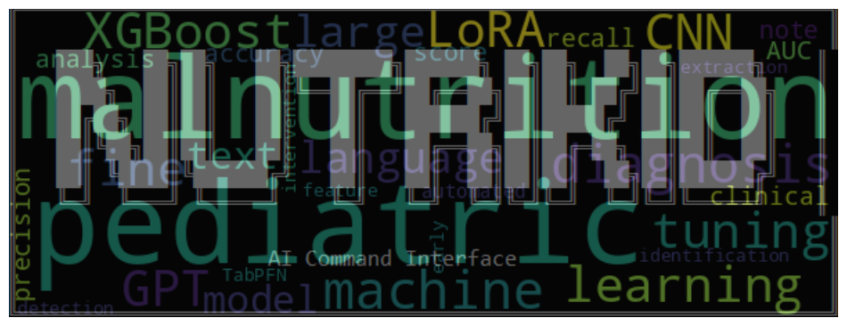

# NutriKids AI: Empowering Early Pediatric Malnutrition Diagnosis for a Brighter Future

Welcome to **NutriKids AI** – an innovative, AI-driven solution designed to revolutionize the early detection of pediatric malnutrition. In pediatric healthcare, early and accurate diagnosis is critical for ensuring timely intervention and improving long-term outcomes. NutriKids AI leverages state-of-the-art machine learning techniques and natural language processing to analyze clinical data, helping healthcare professionals quickly identify children at risk of malnutrition.



## Console Interface

NutriKids AI provides a powerful command-line console interface that enables healthcare professionals and researchers to interact with the system efficiently. The console offers a comprehensive set of commands organized into several functional categories:

### File Operations
Navigate and manage your data files with ease using standard commands:
- `ls`: List directory contents with clear formatting
- `pwd`: Print current working directory with path validation
- `cd`: Change directory with robust error handling
- `cat`: Display file contents with line numbers and pagination support

### Model Training
Train and fine-tune various machine learning models on your clinical data:
- `tunetextcnn`: Fine-tune TextCNN models for natural language processing tasks
- `traintextcnn`: Train new TextCNN models for text classification
- `traintabpfn`: Train tabular probabilistic functional networks on structured data
- `tunexgb`: Fine-tune XGBoost models for optimal performance
- `trainxgb`: Train new XGBoost models for classification tasks
- `llmtrain`: Train or fine-tune large language models for specialized medical text analysis

### Model Evaluation
Assess model performance with comprehensive evaluation tools:
- `evaluatetextcnn`: Evaluate TextCNN model performance metrics
- `evaluatetabpfn`: Evaluate TabPFN model accuracy and effectiveness
- `evaluatexgb`: Generate detailed performance reports for XGBoost models

### Model Inference
Use trained models to make predictions on new data:
- `textcnnpredict`: Make predictions using trained TextCNN models
- `predicttabpfn`: Generate predictions from TabPFN models
- `predictxgb`: Use XGBoost models for inference on new data
- `llminference`: Run inference using fine-tuned large language models
- `ollamaserve`: Deploy Ollama models as inference services

### System Operations
Manage your console environment:
- `clear`: Clear the terminal screen for better visibility
- `quit`: Exit the application safely
- `help`: Access the detailed help system with command documentation

## Getting Started

To begin using ```./nutrikidsai.py```, simply launch the console application and use the `help` command to explore available functionality. For detailed information about specific commands, use `help <command>`.
```
     ╔══════════════════════════════════════════════════╗
     ║             NutriKids AI Console v1.0            ║
     ║      Malnutrition Detection Command Interface    ║
     ╚══════════════════════════════════════════════════╝

    System Time: 2025-03-03 13:05:16
    Type 'help' for command overview or 'help <command>' for details
```

### Example
```
(NUTRIKIDS)% help llminference

        Run inference with a malnutrition detection model (base or fine-tuned).

        Usage: llminference --input-csv <csv_file> | --input-text <text> [options]

        Input Options (one required):
            --input-csv      Path to CSV file with patient notes
            --input-text     Single patient note as text string

        Model Options:
            --model-path     Path to fine-tuned model adapter weights (optional)
            --base-model     Base model name (default: unsloth/Phi-3-mini-4k-instruct)

        CSV Column Options:
            --text-column    Column name containing patient notes (default: Note_Column)
            --id-column      Column name containing sample IDs (default: Patient_ID)
            --label-column   Column name containing true labels (default: Malnutrition_Label)

        Few-shot Options:
            --examples-data     Path to few-shot examples CSV data (optional)
            --few-shot-count    Number of few-shot examples to use (default: 0)
            --balanced-examples Whether to balance positive/negative examples

        Output Options:
            --output-dir     Directory to save results (default: ./llm_inference_results)
            --output-csv     Name of output CSV file (default: malnutrition_predictions.csv)
            --print-report   Print evaluation report if labels available

        Inference Options:
            --use-flash-attention Use Flash Attention 2 if available
            --max-new-tokens     Maximum new tokens to generate (default: 256)
            --temperature        Temperature for sampling (default: 0.1)
            --min-p              Min-P sampling parameter (default: 0.0)
            --stream-output      Stream model output to console
            --seed               Random seed for reproducibility (default: 42)

        Example:
            llminference --input-csv data/test.csv --print-report --stream-output
            llminference --input-text "Patient presents with weight loss of 10kg in 3 months"
```
### Example output
```==================================================
MALNUTRITION DETECTION RESULT
==================================================

PATIENT NOTES:
3-year-old male with gastroparesis. Weight-for-height z-score: -2.9. MUAC: 116mm. Early satiety affecting meal completion....

EXPLANATION:
The patient is a 3-year-old male with a weight-for-height z-score of -2.9, which falls within the range for moderate malnutrition according to the criteria provided. The mid-upper arm circumference (MUAC) is 116mm, which is above the threshold for severe malnutrition but does not meet the criteria for mild malnutrition. The presence of early satiety affecting meal completion could be a contributing factor to the weight-for-height z-score. Given the weight-for-height z-score and the MUAC measurement, the patient is likely experiencing moderate malnutrition.

DECISION: malnutrition=yes
==================================================
Result saved to ./llm_inference_results/malnutrition_predictions.csv
```

## Development Status

⚠️ **This project is currently under active development** ⚠️

Please note that this is a research project in development. Features, APIs, and documentation may change significantly. Use with caution in production environments.


**NutriKids AI** – Because every child deserves a healthy start in life.
